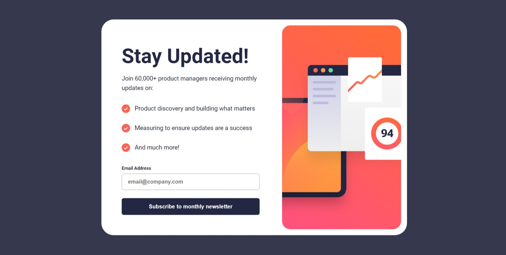

## Table of contents

- [Overview](#overview)
  - [Screenshot](#screenshot)
  - [Links](#links)
- [My process](#my-process)
  - [Built with](#built-with)
  - [What I learned](#what-i-learned)
- [Author](#author)

## Overview

### Screenshot

### Links

- Live Site URL: [https://ZaiBerm.github.io/FEM-NewsLetter-SignUp-Form](https://ZaiBerm.github.io/FEM-NewsLetter-SignUp-Form)

## My process

### Built with

- Semantic HTML5 markup
- CSS custom properties
- Flexbox
- Jvascript

### What I learned

I learned how to use gradient background and how to make the website scroll smoother

## Author

- Frontend Mentor - [@ZaiBerm](https://www.frontendmentor.io/profile/ZaiBerm)
- Instagram - [@Zxirus](https://www.instagram.com/zxirus/)
- Facebook - [Zairus Bermillo](https://web.facebook.com/zairus.bermillo.9)

